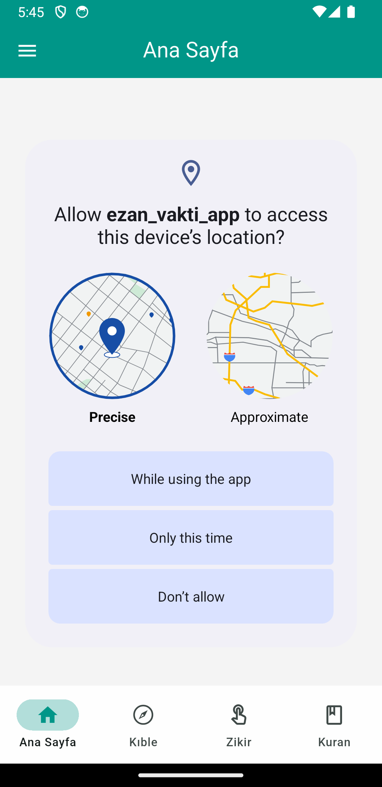
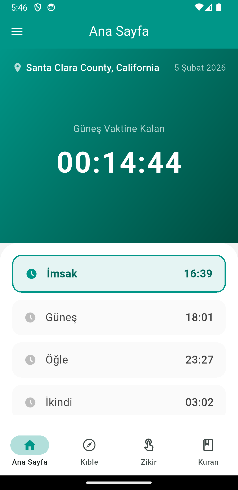
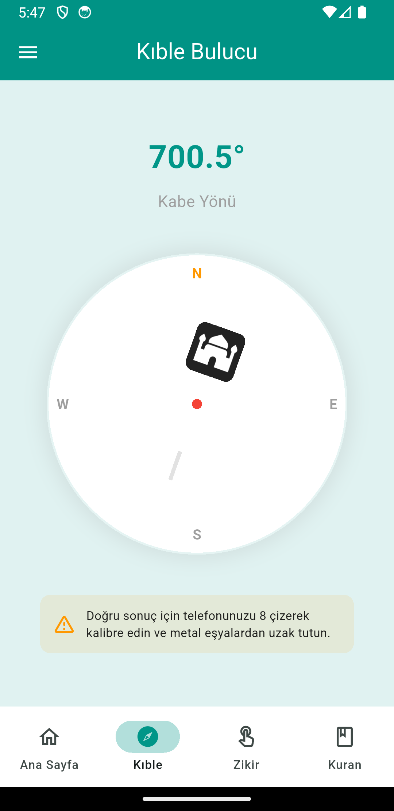
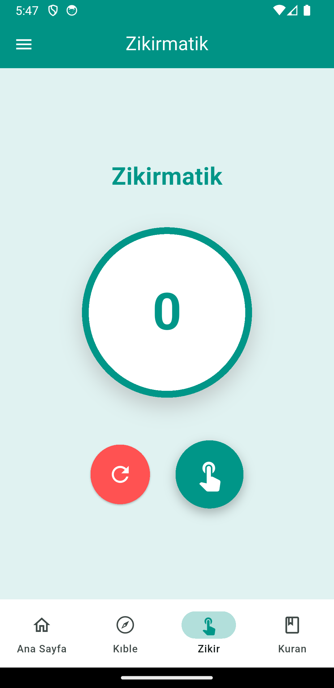
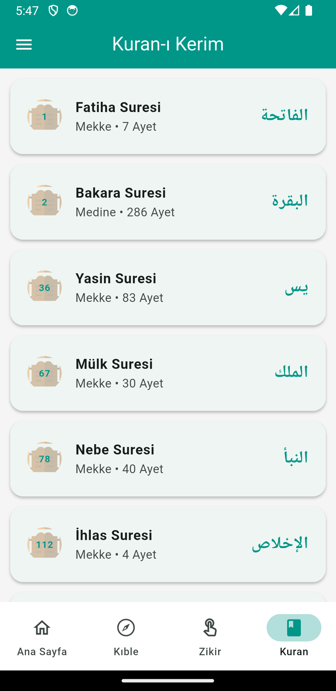
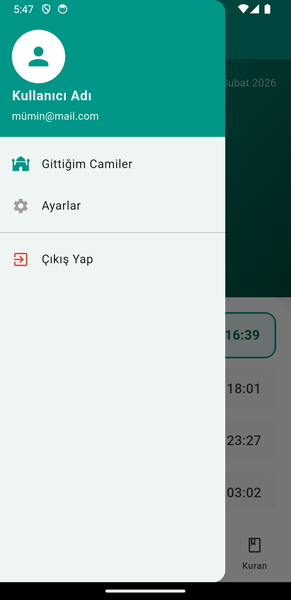
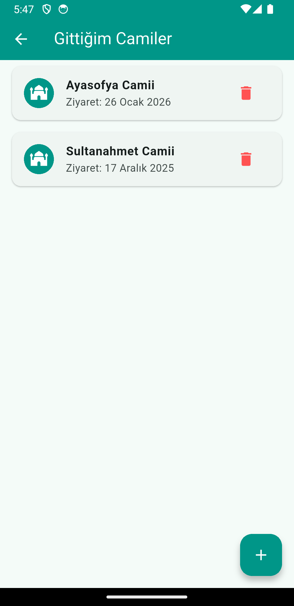

# 🕌 Ezan Vakti App


**Ezan Vakti App**, Flutter kullanılarak geliştirilmiş, modern arayüze sahip ve tamamen **frontend odaklı** bir mobil uygulamadır.  
Uygulama; namaz vakitlerini görüntüleme, kıble yönünü bulma ve temel dini içeriklere hızlı erişim sağlama amacıyla tasarlanmıştır.

> ⚠️ **Önemli Not**  
> Bu proje **yalnızca frontend** içerir. Backend, API, veritabanı veya canlı veri senkronizasyonu bulunmamaktadır.  
> Özellikle **kıble bulucu ekranı stabil ve başarılı** şekilde çalışmaktadır.

---

## 🎥 Tanıtım & Tasarım Videosu

Uygulamanın tasarımını, sayfa geçişlerini ve genel kullanıcı deneyimini incelemek için:  
👉 **[YouTube Tasarım Videosu](BURAYA_YOUTUBE_LINKI_EKLE)**

---

## 📸 Uygulama Görselleri

> Aşağıdaki görseller projeye manuel olarak eklenecektir.

| Konum İzni | Ana Sayfa | Kıble Bulucu |
|-----------|----------|-------------|
|  |  |  |

| Zikirmatik | Kur’an | Yan Menü |
|-----------|--------|---------|
|  |  |  |

| Gittiğim Camiler |
|-----------|


---

## 🧭 Uygulama Sayfaları

Uygulama **5 ana sayfa + yan menü (drawer)** mimarisi ile tasarlanmıştır.

### 📍 Konum İzni
- Uygulama ilk açıldığında kullanıcıdan konum izni ister
- Namaz vakitleri ve kıble yönü için temel hazırlık ekranıdır

---

### 🕰️ Ana Sayfa – Namaz Vakitleri
- Günlük namaz vakitleri listelenir
- **Şu anki vakte ne kadar süre kaldığı** canlı olarak gösterilir
- Minimal ve okunabilir UI

---

### 📿 Zikirmatik
- Dijital tesbih mantığıyla çalışır
- Sayaç artırma ve sıfırlama özellikleri içerir

---

### 📖 Kur’an Sayfası
- Kur’an içerikleri için tasarlanmış arayüz
- Şu an için frontend yapıdadır (statik)

---

### 🧭 Kıble Bulucu
- Cihaz sensörlerini kullanarak kıble yönünü gösterir
- Uygulamanın **en kararlı ve sorunsuz çalışan** ekranıdır

---

### 🕌 Gittiğim Camiler
- Kullanıcının ziyaret ettiği camileri listeleyebileceği bir sayfa
- Frontend tabanlı, veri kalıcılığı bulunmaz

---

### ☰ Yan Menü (Drawer)
- Sayfalar arası hızlı geçiş sağlar
- Uygulamanın navigasyon merkezidir

---

### ☰ Gittiğim Camiler
- Gidilen Camileri Not Alabileceğiniz Bir Sayfadır.
- Uygulamanın not kısmı gibi olabilir

---

## ✨ Öne Çıkan Özellikler

- 📱 Modern ve sade Flutter UI
- 🧭 Sensör tabanlı kıble yönü
- ⏳ Namaz vakitlerine kalan süre gösterimi
- 📿 Zikirmatik fonksiyonu
- ☰ Drawer (yan menü) navigasyonu
- 🎨 Material Design uyumlu tasarım

---

## 🛠️ Kullanılan Teknolojiler

- **Flutter**
- **Dart**
- Material Design
- Cihaz sensörleri (Compass / Orientation)

---

## 🚧 Proje Durumu

| Özellik | Durum |
|-------|------|
| UI / UX | ✅ Tamamlandı |
| Kıble Bulucu | ✅ Çalışıyor |
| Backend | ❌ Yok |
| API Entegrasyonu | ❌ Yok |
| Veri Kalıcılığı | ❌ Yok |

Bu proje, **Flutter öğrenme ve pratik geliştirme amacıyla** oluşturulmuştur.  
Özellikle aşağıdaki konulara odaklanılmıştır:

- Sayfa mimarisi
- Drawer navigasyonu
- Sensör kullanımı
- Mobil UI/UX tasarımı

---

## 🔮 Gelecek Geliştirmeler (Future Improvements)

- 🌐 Canlı namaz vakti API entegrasyonu
- 💾 Local storage / SharedPreferences
- 🔔 Bildirim sistemi (ezan vakti)
- 🌙 Karanlık mod (Dark Mode)
- 🕌 Camiler için konum bazlı kayıt
- 🌍 Çoklu dil desteği

---

## 🚀 Kurulum

```bash
git clone https://github.com/kullaniciadi/ezan_vakti_app.git
cd ezan_vakti_app
flutter pub get
flutter run
```

